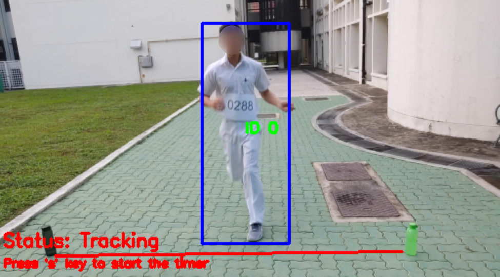
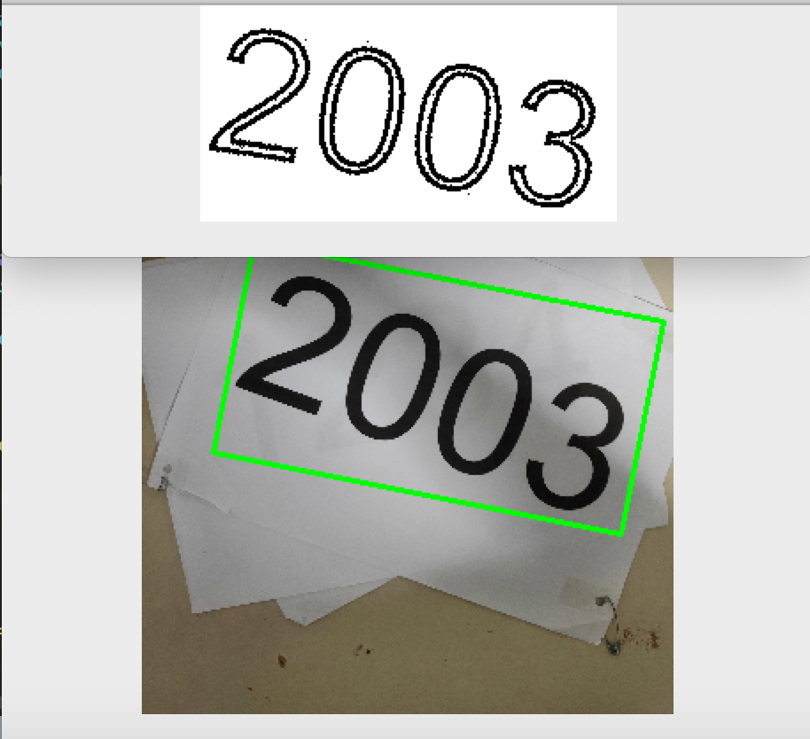

# Runner tag tracker -Capstone--

## About this program
This is my project for Capstone 2019 (Final Year Project of my computer-elective program). This program demonstrates the use of computer vision and image recognition in tracking of runners as they cross a finish line. 

Using computer vision techniques, the program is able to track the runners from a video stream as they get closer to the finish line, and read off their number tags when they cross it, thus identifying the runner and recording down the time which they had finished their run. This makes the whole process autonomous, replacing the need for officials to manually track the runner's finishing times and record their tag numbers. Potentially, it can be used to automate the runner tracking process in cross country marathons in schools.

## Breakdown of program
This problem can be split into 2 parts:

1. Detecting and tracking of runners
2. Detecting and identifying the numbers in the runner's tag

#### Detecting and tracking of runners
In my earlier draft with ImageAI, one problem that surfaced was the slow speed of the program, resulting in a FPS of ~6. This was due to my mistake of running the detector on every frame, resulting a linear runtime for the program, thus making it very slow. 

I was able to solve this problem by splitting the tracking process into 2 phrases - when I run a neural network to detect the runners and when I used trackers from the `dlib` module to track the runners without the neural network (thus reducing the amount of computation). I used a pre-trained model `MobileNet` that was trained on detecting humans, and used PyImageSearch's `centroid tracker` and `trackable object` for managing and tracking runners from start to end. Upon tracking the runners for 5 frames, i will run the neural network to get more precise coordinates of the runners. With this process, i was able to get a FPS of >20, significantly faster than before, even capable of running in real time. 

#### Detecting and identifying the numbers in the runner's tag

Getting this part to work accurately is one of the hardest challenges in this project, one that took up 65% of my time spent. A generalisation of this problem will be **recognising text in natural images** which I found out to be one of the hardest problems in computer vision as well.

In my first draft, upon getting the cropped image of the runner, I directly fed the middle half portion of the image (an approximation of where the tag is) into the TesseractOCR. The output from it was far from accurate and it required feeding the perfect image under the right conditions (no noise, blur) in order for it to work properly. This resulted in a low accuracy as OCRs are trained on recognising text under clear conditions.

In my second draft, I preprocessed the text first before feeding it into the OCR for better results. Below is my pipeline for preprocessing.

1. Feed raw image into pre-trained [East text detector](https://www.pyimagesearch.com/2018/08/20/opencv-text-detection-east-text-detector/) model and get the text regions (highly accurate) 

2. Rotate the regions to get a 4 exact point coordinates where the text is, to prevent cropping of slanted text

3. Do a `Perspective Transform` on the region, to get a straight rectangular frame of text

4. Remove noise from image, and use adaptive thresholding to highlight the digits

Only then did the performance of the OCR improve. I have segmented the code for detecting text in images in the `text_detection.py` file, I have also included sample images in the `sample_photos` folder for you to try the program on. 

Here is an example of the text pre-processing in action:

## Set up
It is recommended that you make a [virtual environment](https://docs.python.org/3/tutorial/venv.html) and activate it first before running the program. 
#### Libaries needed:  
Go ahead and install them using pip

 	pip3 install imutils numpy opencv-python scipy argparse nms pytesseract scikit-image cmake

#### `Dlib`
We will require this module as well, however instead of using pip to install it, please install it from source. Go to their [github page](https://github.com/davisking/dlib), clone their repository (this will take a minute or two), enter it and run `python3 setup.py install`  (this will take around 5 minutes)

## Running the program
To start the program, type:

	python3 run.py --input videos/bigrun_2.mov

The program will first prompt you to select the points that represent the start and end of the finish line. Once set, the program will start to track the runners, you will be able to view the tracker's progress while it processes the video. You will need to press the **s key** to start the timer for the program to calculate the runner's finishing time. Once done the program will output a csv file named `tracked_results.csv` of runner IDs and their finishing times.

### Optional parameters
Below are some parameters that you can set when running the program:
 1. `-f/--feedback` Toggling it to `True` turns the feedback to maximum and you will be able to see each frame that the program processes and the processed text frame that is fed into the OCR.  `Default:False`
 2. `-i/--input` Path to the video that the program reads
 3. `-s/--save-images` Toggling it to `True` will save all images that have been fed into OCR in the `train_data` folder, to be used for future purposes. `Default:False`
 4. `-c/--confidence` Sets the minimum confidence for the bounding boxes outputted by model that the program accepts to be a runner
 5.  `-k/--skipped-frames` Sets the frame interval between which the neural network is used (again), affects FPS.

### Resources
The `videos` folder contain videos that you can test the program on. The `sample_photos` folder contains images which you can run the text detection and recognition on. 

## Limitations
Among the videos tested, the program managed to read **80%** of the tags correctly. Although measures have been put in place to increase the probability of obtaining a correct tag number, the program is still **severely limited** by the Tesseract OCR, most of the errors were in fact due to *false positives* where the OCR recognises a background object, e.g. part of a hand, to be a number. 

This probability has been reduced by using preprocessing techniques such as *noise reduction* and *adaptive thresholding* to show only the numbers on the tag but it's very difficult to fine-tune the parameters of these functions that work for all cases and thus having *false positives* is hard to prevent. Attempts to isolate digits areas using openCV's `findcontours` function have been succesful but the OCR still failed to correctly read some of the digits. A model was trained on the MNIST dataset but it too has failed the classification miserably due to the poor lighting and variations in text sizes and distortion. Thus the program will work properly if a video of good quality is used and the text are in excellent lighting conditions.

Another problem that surfaced is when the program failed to detect runners who "tailgate" other runners at the finish line. This problem occured when processing *bigrun_3.mov*, due to the association of closest centroids to track runners between frames, the program will associate the original runner's bounding box with the newly appeared runner. Thus failing to detect one of the persons and their number tags.

## Conclusion
Overall, I am very grateful for this experience as it has allowed me to explore openCV and train myself to learn independently. I originally intended for this program to be able to replace RFID systems in schools, but this possibility seems very unlikely due to the unreliability of the text recognition system and many physical challenges such as blur text, covered text and poor image quality. 

This program can still be used to track runners in small races, where the image is not too crowded and runners are far apart, and in good lighting conditions.

## Future work
I have discovered the [Street View House Numbers dataset](http://ufldl.stanford.edu/housenumbers/) from stanford whose challenge - detecting and recognising blur,unfiltered text in natural conditions - is extremely applicable for this project. Due to time contraints, I was not able to train a classfier based on this dataset and use it in the program. If I was given more time, I will explore this possibility and hopefully train a more accurate classifier to replace the Tesseract OCR.
